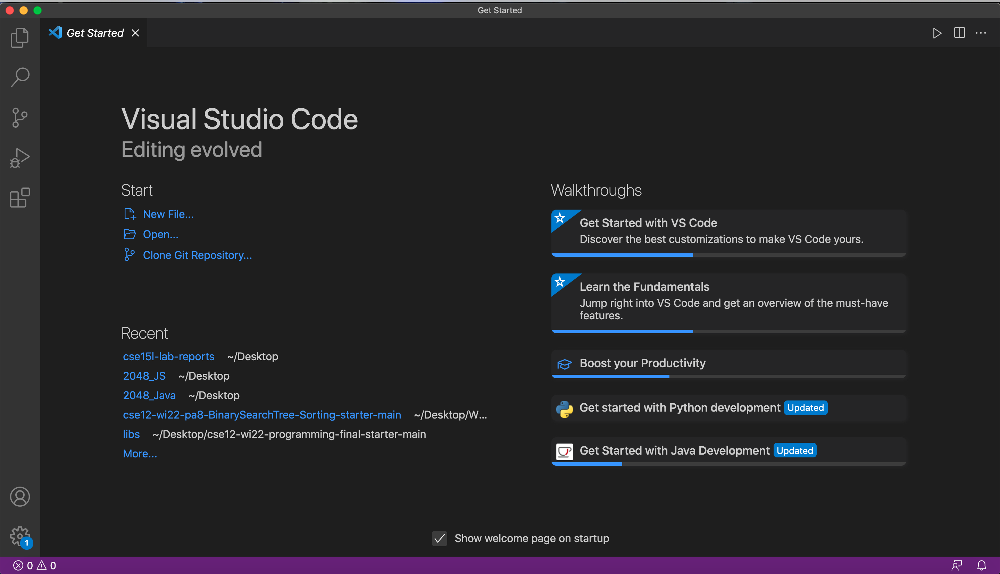
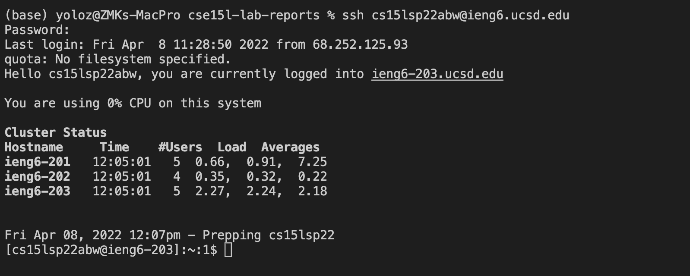
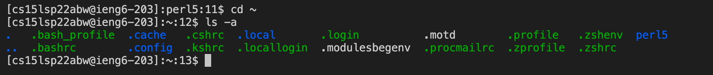
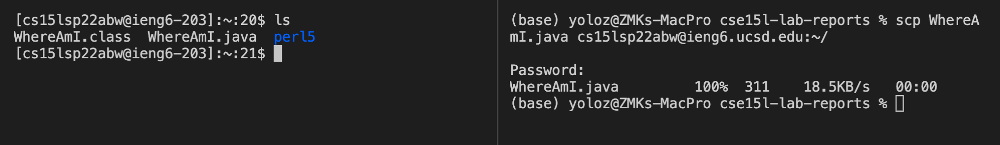
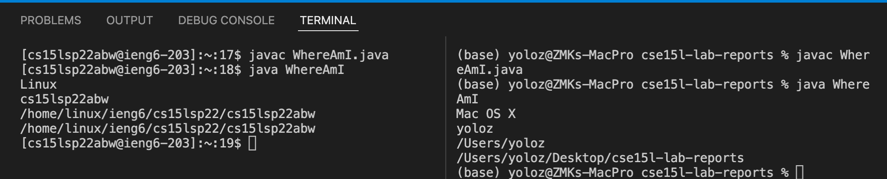
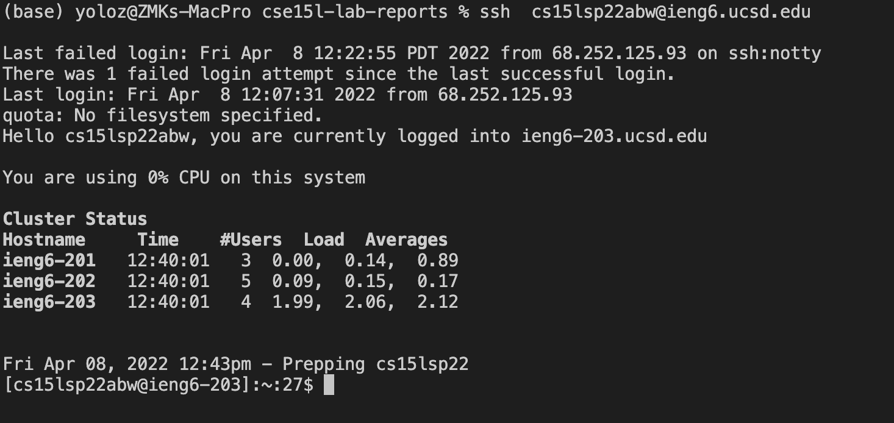
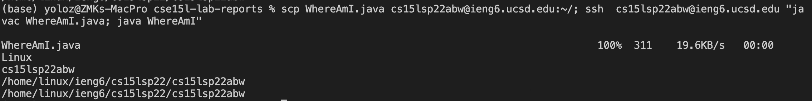

# Lab Report 1
## Remote access using ssh

> this tutorial/report shows you and I how to remote access a computer through ssh.

### Step 1: installing VScode
> VScode is *the* most convenient development tool as far as the author is concerned. It can do everything. Literally.

1. Go to the [VScode](https://code.visualstudio.com/) website and download.
2. Install and follow the steps. Open the application once you are finished installing, you should see the following

### Step 2: remote connecting
>We are going to use the terminal provided by VScode to use ssh to access other computers.

1. Open the Terminal VScode provides, and we are currently in the local directory. We want to use the command `ssh` to connect to the `ieng` server.
2. We enter `ssh <username>@ieng.ucsd.edu`, enter the password, and we would be inside the server, as the prompt of the terminal has changed.

### Step 3: run some commands in the remote terminal

> Now you see why it is useful to have a terminal, right?

1. Because we don't have access to the GUI of the server, we have to access it through "text" commands, which replaces the clicking of icons.
2. In the terminal, we simply enter the following two commands
* `cd ~   `this command changes the current directory to the root directory
* `ls -a  ` this command lists all the directories contained in the current directory, including the hidden ones.

### Step 4: moving files with `scp`
> Sending a file from your local computer to a remote server.. This feels more like hacking, I guess?

1. We enter the command in our local terminal `scp <file to transport> <server name>:<server directory>` as shown below in the code.
2. We enter the password and see that the file appears in the server side of the terminal successfully(I have compiled the java file on the server side already, but before `javac` there is only a `.java` file on the server side).

3. To prove that the file is really on the server side and that it would perform differently depending on the environment, we run the file and see that we are at different locations.

### Step 5: Setting an SSH Key
> Typing in a password everytime you login is cumbersome. Let's do something to make our lives easier.

1. First we generate public and private keys locally with `ssh-keygen`. Then we create a directory on the server side called `.ssh`(in my case it is already present when I tried to create it, but just do it to make sure it is there).
2. Then we `scp` the public key file that is local to the remote server. This allows us to connect to the server or transport files without entering passwords.

### Step 6: Optimizing Remote Running
> Maybe our lives could just be a *bit* more easier?

If we want to modify the java file, and upload it to the remote computer to try out the code, we could make the following procedure more automatic to speed up our task.
1. `scp ` the file to the remote server.
2.  `ssh ` into the remote server.
3. run `javac`.
4. run `java`.

We could do all these steps in one line of code, and use the UpArrow key to repeat the process without typing everything out.

    

