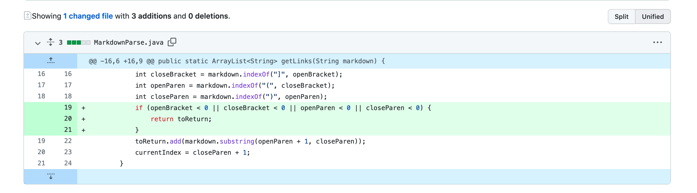
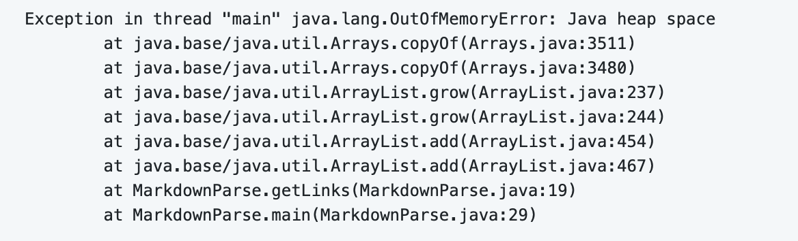
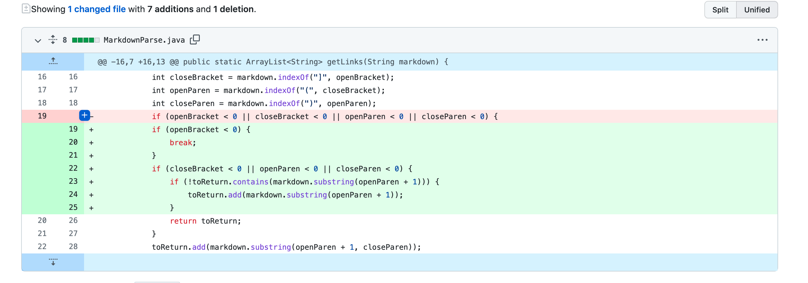
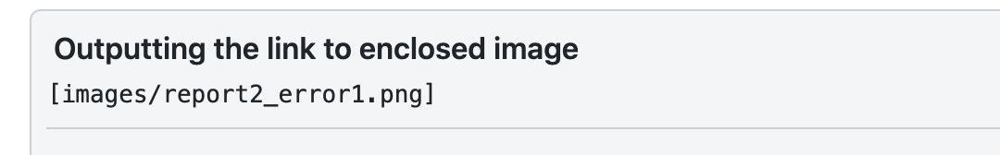
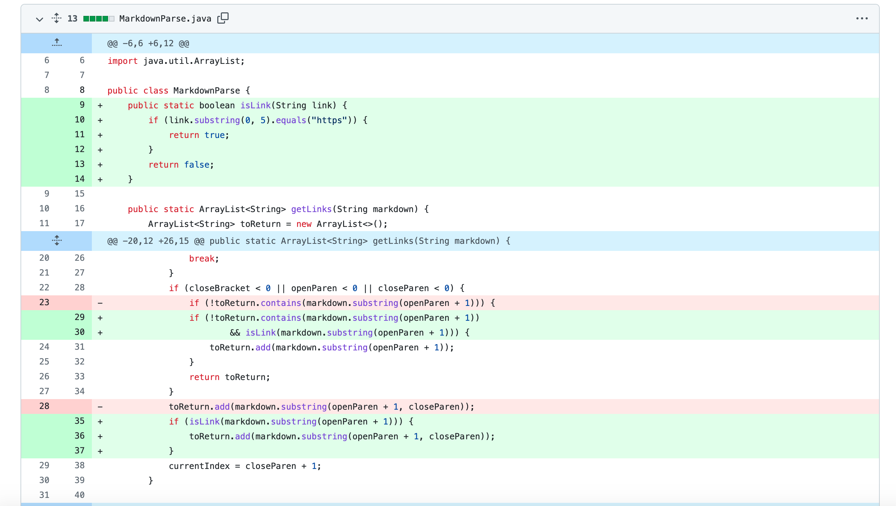

# Lab Report 2
## Debugging

> This lab report introduces formal/academic terms used in debugging and goes through an example of debugging.

### Error 1:
I made the following change to the original MarkdownParser Code, in order to fix the error caused by an input.

This [file](https://github.com/Z0zzz/markdown-parser/blob/main/test-file2.md) went through a test and induced an error. Such an input is called *failure inducing input*, and the error message is the following

The failure inducing input contains a link that has more characters that come after link has ended, which caused the infinite loop error(symptom), and the program has a bug in the algorithm in that it doesn't have terminating condition that checks for the end of file. By adding such a conditional statement, the bug was able to be resolved.

### Error 2:
The second error induces the following change to the code.

This [file](https://github.com/Z0zzz/markdown-parser/blob/main/test-file3.md) went through a test and induced an error.

The error produces a symptom of wrong output, namely, it returns an empty array instead of one with a link in it, which is included in the markdown file.

In this case, the failure inducing input contains a link, but the link is not in the correct form which would be parsed by the code, so the code couldn't recognize the link by showing the symptom of giving the wrong input. The bug in the code is the failure to recognize that a link might not be fully wrapped within a pattern, and it should detect a valid even when the given pattern a link is supposed to be wrapped in is not given.

### Error 3:
The last failure inducing input is the following
[file](https://github.com/Z0zzz/markdown-parser/blob/main/test-file4.md). 
The symptom of the input is the wrong return value, namely

This input is fixed by the following change to the code.

In this case, the failure inducing input has the correct format for a link, but what is supposed to be in the position of the link is not a link, instead, it is a image, and this is the symptom. The bug in the code is that the code doesn't check for any situation where what is supposed to be a link might not actually be the link. So a helper function is added to navigate such cases.
