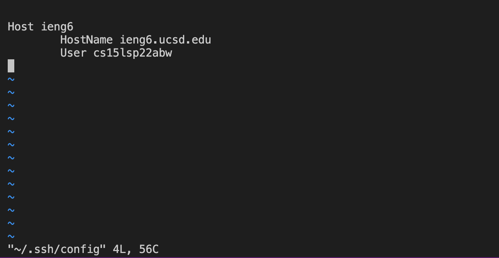
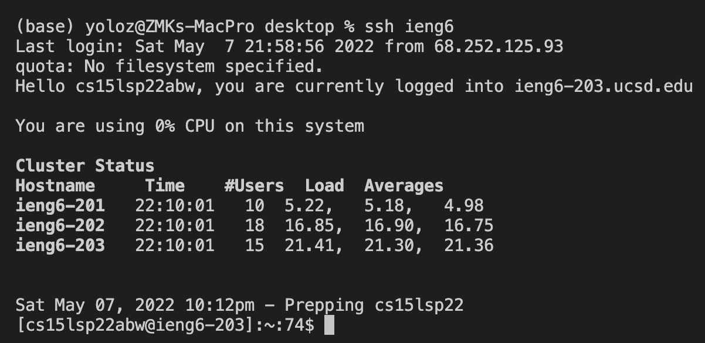
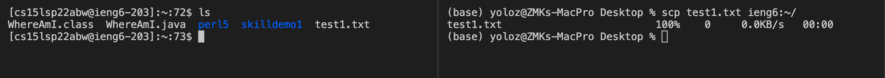
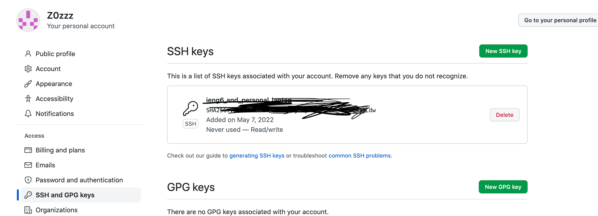
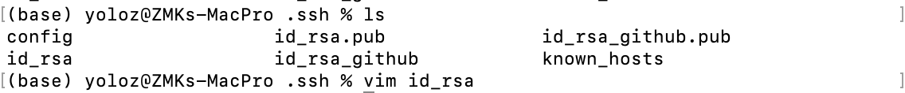
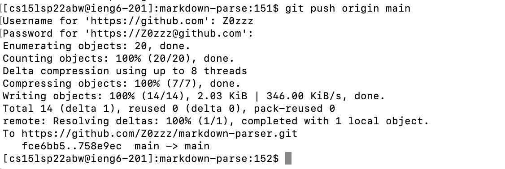
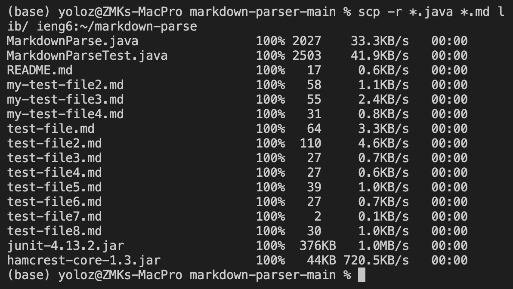
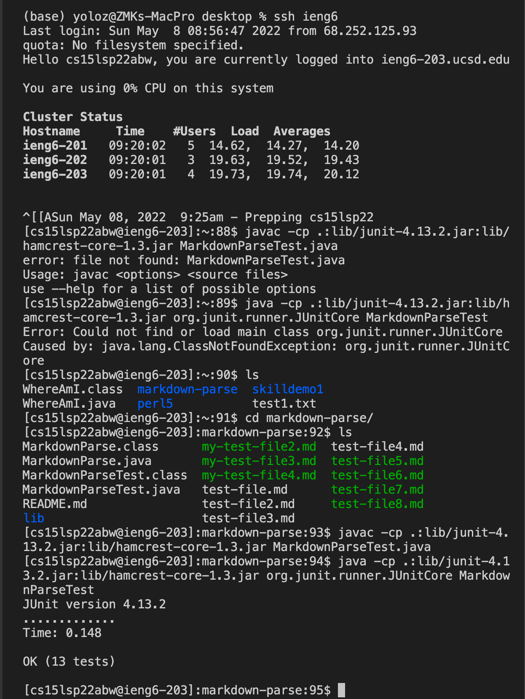
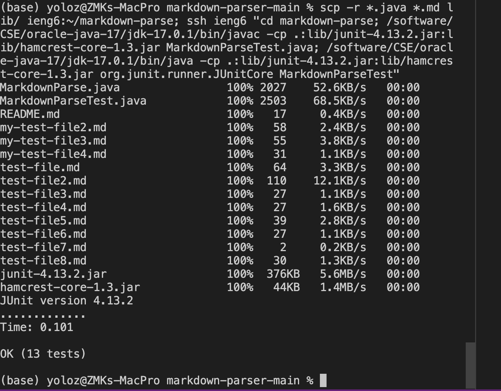

# Lab Report 3
## Streamline remote accesses

> This lab report introduces methods and utilities for accessing remote serves.

### Streaming ssh configuration
>we want to simplify the ssh log in process. How could we write less code to access a remote server?

1. we use vim to edit a .ssh file, which will be used to simplify our access to remote server.

2. the content of the file should be as the following. After finishing editing, enter `:wq` to save and quit.

3. now we can ssh with fewer characters of code.

4. we could also `scp` with less characters

## Github Access and keys
>Just like we use keys to log into the remote server, we now use keys to commit and push into GitHub.
1. After we have generated a key pair, we need to tell GitHub of the public key we are using, so it recognizes us when we commit and push.

2. The private key is stored locally in the same place as public key, where we could open with a text editor(here I used vim). But we are not showing its content.

3. If we do a new keygen on the remote ieng6 server and follow the first step, then we could commit and push from the ieng6 server onto the github.

4. The result of the push is found [here](https://github.com/Z0zzz/markdown-parser).

## Copy and scp whole directories
> we could scp files, now we are about to scp directories.
1. we copy the whole directory into ieng6 server with the `-r` option

2. we then show that everything is indeed copied over by running the code.

3. we then make our lives a little easier by combining what was done above into a single command.

