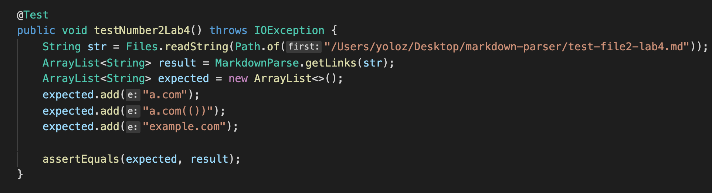
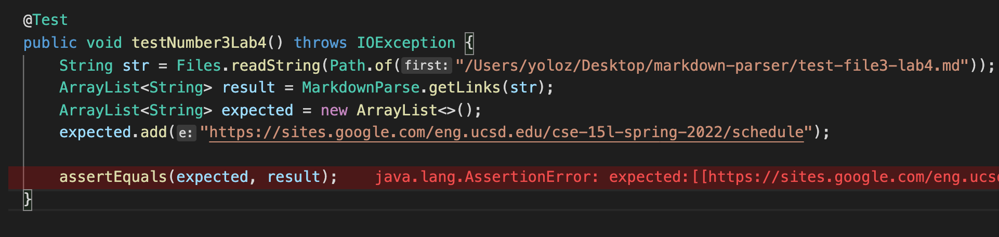
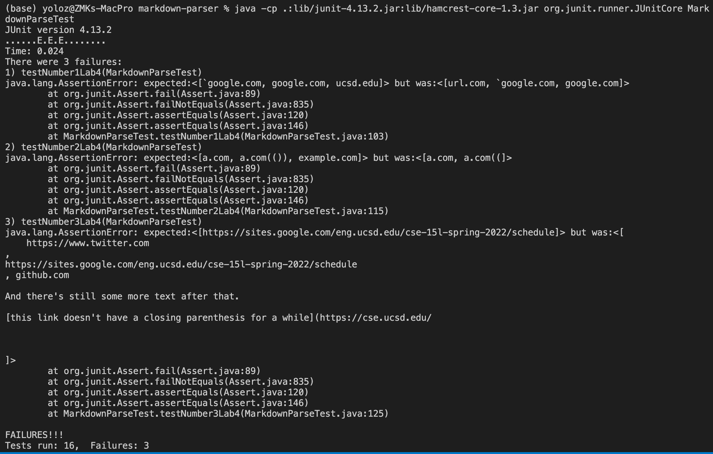
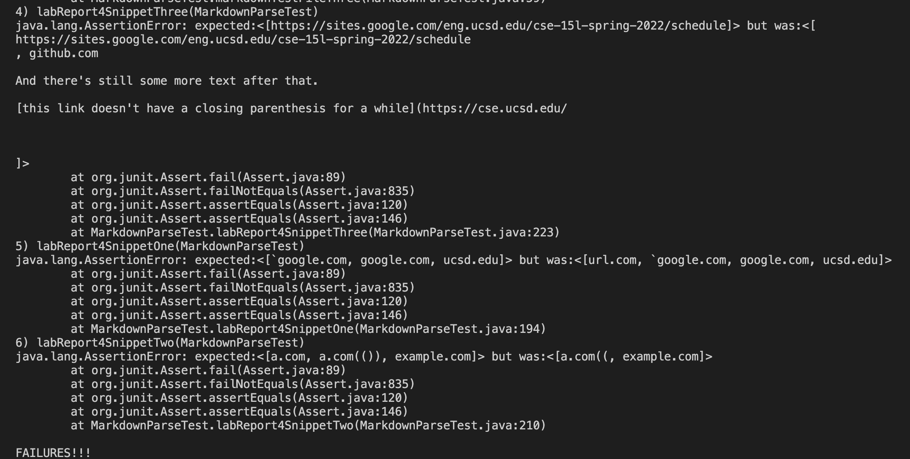

# Lab Report 4
## Code Snippets and Tests

> In this lab, we test 3 new tests for 2 markdown parsers, and give debugging informations accordingly.

### Repositories I evaluate
1. [Repository from classmates](https://github.com/ddn005UCSD/markdown-parser)
2. [My own repository](https://github.com/Z0zzz/markdown-parser)

### What does each of the three test looks like?

1. 

`[a link`](url.com)

[another link](`google.com)`

[`cod[e`](google.com)

[`code]`](ucsd.edu)

2. 
[a [nested link](a.com)](b.com)

[a nested parenthesized url](a.com(()))

[some escaped \[ brackets \]](example.com)

3. 
[this title text is really long and takes up more than one line

and has some line breaks](
    https://www.twitter.com
)

[this title text is really long and takes up more than 
one line](
https://sites.google.com/eng.ucsd.edu/cse-15l-spring-2022/schedule
)

[this link doesn't have a closing parenthesis](github.com

And there's still some more text after that.

[this link doesn't have a closing parenthesis for a while](https://cse.ucsd.edu/

)

And then there's more text

### Tests
The tests for these three files look like the following

### Test output
My code yields the following:

The other group's code yields the following:

### How to change the code in order to resolve these issues?

1. It would take a small amount of code to solve. We need to use conditional statements to detect whether a backtick precedes or succeeds a open/close bracket in order to determine whether this link is of a valid form or not.

2. Resolving only the issue of duplicating brackets/paretheses, a small code change is not enought; a whole new algorithm should be designed for it. A common technique to detect duplicates of brackets is to use stack data structure. We feed in each open bracket and parenthesis one at a time, and if we find a close bracket or parenthesis, we pop from the stack. Finding out what is left in the stack upon the removal every bracket or parenthesis could help determine whether we have reached the end of of a link, but this would require a newly implemented data structure that could satisfy that, since we couldn't look at everything in a stack.

3. This one is a quicker fix and could be done with a small amount of code. We could also use a conditional statement to determine whether there are linebreaks inside of the contented wrapped around by the brackets and parenthesis, based on the result we could determine whether and how we can extract the link. If there is a linebreak inside brackets, then there is no link; if there is a linebreak inside parenthesis, then we could extract the link and search again after the link(with the conditions to check for closed brackets and so on.)